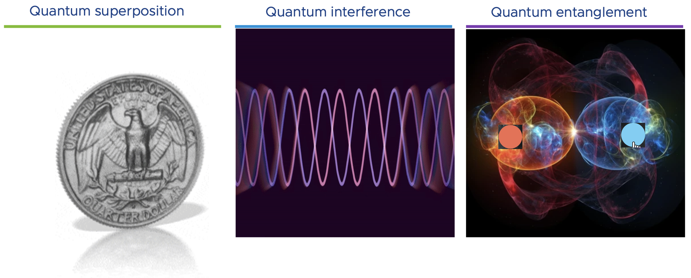

# Introduction to Quantum Computing and the Quantum Threat to Cryptography

## Classical Computing vs. Quantum Computing

In the world of computing, a new paradigm is emerging with promising capabilities although still with limitations: quantum computing. The existing one, classical computing, powers our everyday computers. This relies on bits, represented as 0s and 1s, as the fundamental unit of information. These bits process data sequentially, limiting computational power for certain complexity problems.

Quantum computing, on the other hand, relies on the minimal unit of quantum information, the quantum bit or qubit, as the quantum counterpart of a classical bit. Quantum computing leans on three main phenomena that make very special the qubits so special. These 3 phenomena are:
* **Superposition**: Qubits can exist in multiple states simultaneously, thanks to this phenomenon. This allows quantum computers to perform parallel computations, resulting in exponentially higher processing capabilities for specific tasks.
* **Interference**: This specific capability is stressed by the quantum algorithms like Shor or Grover. It uses constructive interference to amplify the correct solution(s) to the problem to compute, and it uses destructive interference to minimize all other possible outcomes.
* **Entanglement**: is a feature that interconnects two or more qubits and maintain their states correlated regardless of the distance between them. This makes the state of any qubit depends on all the others. This is especially important in quantum communications, but also in quantum computing as processing one single qubit we are acting on all others entangled at once.

## The Quantum Threat to Cryptography

While quantum computing promises remarkable advancements, it poses a significant threat to the security of classical cryptographic systems that have safeguarded our sensitive data for decades. This quantum threat arises primarily due to an ingenious quantum algorithm known as Shor's algorithm.

###     Shor's Algorithm

Shor's algorithm, developed by mathematician Peter Shor in 1994, is a groundbreaking quantum algorithm designed to efficiently factorize large numbers. Factoring large semiprime numbers is a computationally intensive task for classical computers, forming the backbone of widely-used public-key encryption algorithms like RSA (Rivest–Shamir–Adleman) and ECC (Elliptic Curve Cryptography).

###     Quantum Attacks on RSA and ECC

RSA encryption relies on the difficulty of factoring the product of two large prime numbers. Shor's algorithm, when executed on a powerful enough quantum computer, can rapidly factorize the RSA modulus, breaking the encryption and compromising the confidentiality of encrypted messages.

Similarly, ECC, another widely-used cryptographic technique, relies on the complexity of solving the discrete logarithm problem on elliptic curves. However, Shor's algorithm can efficiently solve this problem on a quantum computer, undermining the security provided by ECC.

## The Significance of Quantum-Resistant Cryptography

The quantum threat to classical cryptographic systems necessitates the exploration and adoption of quantum-resistant cryptographic techniques - Post-Quantum Cryptography (PQC). Post-Quantum Cryptography refers to a new generation of cryptographic algorithms explicitly designed to withstand attacks from quantum computers.

###     Characteristics of Post-Quantum Cryptography

Post-Quantum Cryptographic algorithms are rooted in mathematical problems that remain challenging for both classical and quantum computers to solve. They provide a robust defense against quantum attacks, ensuring the security and confidentiality of sensitive data in the quantum era.

###     Ensuring Long-Term Security

The importance of Post-Quantum Cryptography lies in its capability to ensure long-term security in the digital age. As quantum computing technology advances, classical cryptographic systems could become vulnerable to attacks, making the transition to quantum-resistant solutions imperative.

## Conclusion

Quantum computing holds immense promise for various fields, but it poses a significant challenge to classical cryptographic systems. Shor's algorithm threatens the security provided by RSA and ECC, calling for the adoption of Post-Quantum Cryptography to safeguard our data and communications in the quantum era. In the subsequent chapters, we will delve deeper into the principles of Post-Quantum Cryptography and its applications, exploring its role in securing our digital future.