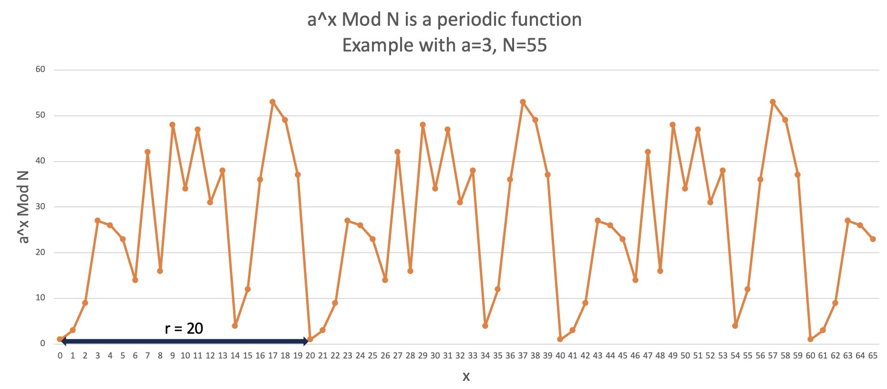
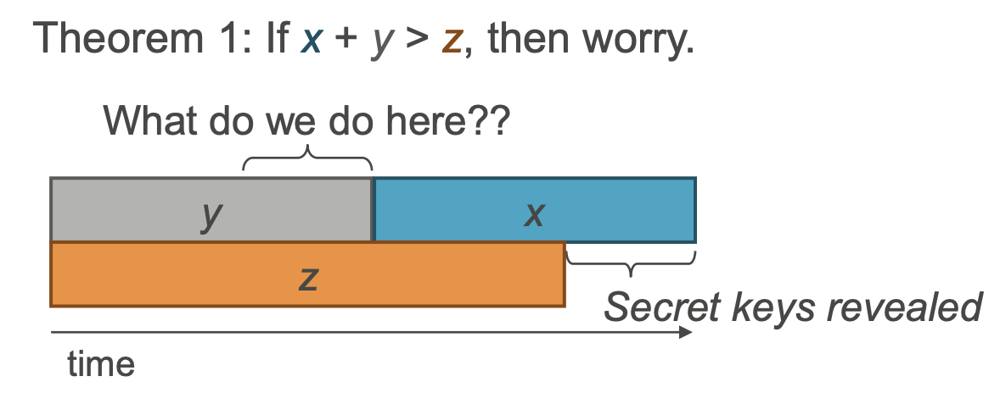

# Quantum Threat and Cryptanalysis

Let's explore here in more detail the quantum threat to classical cryptographic systems and the well-known algorithm that poses a significant risk to their security like the Shor's algorithm. Understanding the implications of quantum attacks on widely-used encryption schemes like RSA, ECC and others will highlight the need to introduce quantum-resistant cryptographic solutions. Knowing how long the data has to be protected and guessing a date for potential availability of reliable quantum computers, the urgency for action is revealed. But let's go step by step.

Let's move trough...
- [Quantum Threat to Classical Cryptographic Systems](#quantum-threat-to-classical-cryptographic-systems)
- [Introducing Shor's Algorithm](#introducing-shors-algorithm)
- [Shor's Algorithm for Factoring](#shors-algorithm-for-discrete-logarithms)
- [Shor's Algorithm for Discrete Logarithms](#shors-algorithm-for-discrete-logarithms)
- [Impact of Quantum Attacks on RSA and ECC](#impact-of-quantum-attacks-on-rsa-and-ecc)
- [Harvest Now, Decrypt Later - HNDL](#harvest-now-decrypt-later---hndl)
- [What about symmmetric key protocols and hash?](#what-about-symmmetric-key-protocols-and-hash)
- [Conclusion](#conclusion)

## Quantum Threat to Classical Cryptographic Systems

Define the quantum threat as the potential of quantum computers to break classical cryptographic schemes efficiently.
Discuss how quantum computers exploit certain mathematical properties to outperform classical computers in specific computations.
Explain that the realization of large-scale quantum computers poses a significant risk to the security of classical encryption.

## Introducing Shor's Algorithm

Around 1990 quantum computers were only a theoretical idea on which many academical minds were working, after first introduction suggested by Richard Feynman one decade before. At this moment, this new computer was considered only to avoid the difficulties that classical computers have to simulate quantum mechanical systems. The proposal was to create a new computer based on the quantum mechanics principles and this way avoid the usual restrictions imposed on simulations running on classical computers. So, the initial purpose devised for quantum computers was physics simulation.

Although other algorithms appeared before, it was the Shor's algorithm, proposed in 1994 by mathematician Peter Shor, which opened the possibility to use the quantum computation to calculate easily other problems that aren't easy for traditional computers. To be precise, the Shor's algorithm is able to factorize large numbers in polinomial time as it uses less steps to do it. This is an exponential speed up versus the best algorithm known today to factorize on classical computation. Shor's algorithm solves also easily discrete logarithm problems, which is also an NP problem.

## Shor's Algorithm for Factoring

Let's see whay the factoring problem is solved by Shor's algorithm so fast.
Our factoring problem starts with a known number N, such that N=p*q, where p and q are positive prime numbers we want to find.

There are several ideas that Shor introduce to solve this, first is to associate the factoring problem with finding the order of a function.

Consider a number x co-prime with N and let's consider a function x^r mod N. The order of this function will be the smallest r that accomplish: 
```console
x^r mod N = 1
```

Where is the relationship between this and the factoring problem?

Supose we can find that r is equal to 2 and therefore 
```console
x^2 mod N = 1 (1<x<N-1)
```
Then
```console
x^2 - 1 mod N = x^2 - 1 = 0 (N)
(x+1)(x-1) = 0 (N)
```

So, this means that x+1 or x-1 is a divider of N, and therefore it is one of our solutions p or q.


How then we proceed to do the calculation?

Let's select a random number "a" co-prime with N, and we search the order for a^r Mod N.
Here we can have a solution where r is pair or odd:
- r is pair ==> the solution is x = a^(r/2)
- r is odd ==> we start again selecting a different "a" number co-prime

This function is a periodic one, and we can observe the repetitive pattern shown in an example for a=3 and N=55 in the picture:



The periodiciy in the example is r=20. Other values will produce a different line, but it will be again a repetitive pattern, and we will have another r value.

This periodicity is key here as the problem has turn from find the factors to find a frequency multiple of two for this function.

The algorithm has three main stages:
- **quantum period finding**: used to identify the repetitive pattern lenghts 
- **quantum Fourier transform**: here the periodicities are converted to frequencies, and here rely the speed up of the algorithm as a classical Fourier transform takes around N log(N) = n*2^n steps to Fourier transform N =  2^n numbers, while the quantum equivalent can be done with only log^2(N) = n^2 steps. This is exponential advantage.
- **classical post-processing**: the result (frequency) measured will be processed using the fraction continues method to get the final result.

## Shor's Algorithm for Discrete Logarithms

The discrete logarithm problem is relevant in classical cryptography as it has been a good candidate for a trapdoor function. In fact, Diffie-Hellman key exchange, the first published public-key cryptographic
protocol is based in this problem.

The discrete logarithm problem can be explain as having G =<g> a cyclyc group generated by g, written multiplicaticately. Give an element x belonging to G, the discrete logarithm of x in G with respect to g, or log_g x is the smallest positive integer α such that g^α = x. So, the discrete logarithm problem is the problem of calculating log_g x.

This problem seems a good trapdoor function, as we can compute efficiently the g^α. But given x, we don't know of any classical calculation method that does the calculation of log_g x in polynomial time. And this is the reason why it has been at the foundation of classical security key exchange protocols.

This problem is a good fit again for Shor's algorithm, because as we saw before factoring a number N we were able to adapt it as the calculation of discrete log in (Z_N)^x. Now we have a cyclic G and we will need to know the order of G. This periodicity is the key again to apply later the QFT inverse primitive, that provides the same exponential speed up vs the classical alternative.

## Impact of Quantum Attacks on RSA and ECC

The factoring and discrete logarithm problems can't be considered as trapdoors in the quantum computing era. This impacts directly in the basis of our current public key exchange protocols that are present everywhere as we do banking transactions, purchases online, goverrnment transactions, etc. These cryptographic schemas provide confidentiality, authenticity, and non-repudiation. They are at the foundation of many internet standards, like Transport Layer Security (TLS), Secure Shell Protocol (SSH), S/MIME, and Pretty Good Privacy (PGP). We use also public key cryptography for email traffic and digital signatures.

All this standards can be considered not-enough protected when an eavesdropper is equipped with a powerful reliable quantum computer. Traditionally, when protocols have been considered weak, it has been easy to do some adjustments in order to recover strengh. By increasing the number of bits, has been very easy to do temporarily impractical any hacking activity. But this is no longer the situation as a brute force attack for RSA 2048 moves from impossible even with a powerful cryptographic network to hours or seconds.

Let's do an small calculation to estimate the time required to break RSA 2048 and ECC 256.
The brute force attack isn't the most efficient, there are others like side attacks, but can depend on the implementation and our approach is more generic to get the number.

### RSA 2048
Our number N will have 2048 bits and is the result of the product of to prime numbers. The number of primes smaller than a number N is approximately N/ln(N). Therefore the number of 1024 bit primes (more or less the length required for 2048 bit modulus) is approximately:

2^1025 / ln(2^1025) − 2^1024 / ln(2^1024) ≈ 2.52×10^305

So, with this number of primes, we can calculate now the number of RSA moduli (i.e. pairs of two distinct primes), which is:

(2.52×10^305)^2 /2 − 2.52×10^305 ≈ 3.17×10^610

This is the number of prime pairs we should use in a brute force attack. This number is huge. Even using the computational power from the Bitcoin network, as we can see [here](https://www.blockchain.com/explorer/charts/hash-rate?scale=1&timespan=all) with 368x10^18 ≈ 4x10^20 operations by second (or 1,26x10^28 ops/year), the time to execute the attack will take 2.5x10^582 years. If we compare this time with the estimated age of the universe with 13.7×10^9 we see how long it would take to break RSA 2048.

### ECC 256
Now, the ECC 256 has a secret key with a length of 256 bits. The length of the secret key determines the hardness, the longer it is the harder it is for an attacker to break it.

ECC 256 has 256-bit secret keys, so a total of 2^256 potential secret keys or 1.15x10^77. If we use again a brute force attack with the same computational power used before (1,26x10^28 ops/year), this attack will take 9.16x10^48 years. This is again a number higher than the age of the universe (13.7×10^9).


|Algorythm | Time to break using classical brute force | Time to break with quantum Shor (depends on # of qubits)|
|---|---|---|
|RSA 2048 | 32.5x10^582 years | 10 sec (1) - 104 days (2) |
|ECC 256 | 9.16x10^48 years | 1 hour or 1 day (3) |

With this scenario, there is no recovery increasing the key size. New protocols able to resist a quantum attack are required and this is the motivation of the Post-Quantum Cryptography field, to identify those security algorythms that can resist a quantum computer attack. 

But when should these protocols available and when should it be in use by industries and goverments?

## Harvest Now, Decrypt Later - HNDL
Harvest Now, Decrypt Later (HNDL) refers to the idea that a nation-state can gain access to currently encrypted data and store it until a reliable quantum computer appears and then decrypt all data at that later time.

In term of data security we have to decide if this is a threat for our data and act accordingly to mitigate it if applies.
To analyse if our data is in risk of HDNL we have to know or estimate the answer to the three following questions:

**How long should our encrypted data be secured?**
This demands to know well several internal aspects:
- the **kind of data** we protect and the motivation. In some cases can be fiscal records and these have regulation, others are more business oriented (IP, patents, designs...) which could require specific times and others can be more IT (logs, backups) for safety measures, and many times a mix of them in databases or application records with personal and individual information forcing to apply the most demanding regulation. Anyway, all sensible data should be protected and we would apply a different and specific time criteria to each kind. Obviously, this list must include the certificates and keys for encryption, too.
- the **security mechanisms implemented/used**. By knowing the previous sensible data inventory, we should identify the ways implemented to protect the data. This requires to map data with the protocols and their implementation. As we have seen previously, the systems using public key exchange like RSA or ECC, are affected by the quantum threat in a different way than symmetric key algorythms like AES. 

**How long we need to move to quantum-resistant algorythms?** 
If we decide at any time to change the way we protect our data (for an specific protocol or several) to quantum-resistant ones, how long it will take this process? This time correlates the availability of inventories for security protocols, sensible data and the complexity of the implementations.

**When we'll have around a reliable quantum computer powerful enough?**
This a very discussed question. While the theoretical implications of the Shor algorythm are out of any discussion, the possibilities to run it to crack any of the current classical protocols like RSA are none.
The current development stage for quantum computers is searching ways to reduce noise, increase the coherence times for qubits and scale the total number of qubits contributing to calculation. This is why current quantum computers is said to be in the Noisy Intermediate Scale Quantum (NISQ) era.
Based on the current capabilities of existing quantum computers, prone to considerable error rates and limited in the number of qubits, these are far from pose a threat now. That said, if we look in the progression they have, the increase of economical investments these last years on the quantum development and the ecosystem growth, and the acceleration in the number of patents each year, the time required is reducing fast. Based on these elements the most optimistic predictions expect the enough reliable quantum computer to arrive in 5 years, while others consider one or more decades.

If you want to dive in a sample of opinions about how close it the quantum threat, beloging to 40 experts in this subject, take a look inside this [QUANTUM THREAT TIMELINE
REPORT 2022](https://globalriskinstitute.org/publication/2022-quantum-threat-timeline-report/).

Anyway, if we get our answers from the previous questions, now we can easily guess "when we need to start worrying". 
This moment is when “X” (the amount of time that we want our data to be protected), plus “Y” (the time we need to transition the security implementations from classical to quantum-resistant), is greater than “Z” (the time we estimate for quantum processors to have reached a development level enough to breach existing encryption protocols).



This formula, known as Mosca's Inequality, was proposed by Michele Mosca some time ago. You can see it in a presentation by April 2015. [See slide 20](https://csrc.nist.gov/csrc/media/events/workshop-on-cybersecurity-in-a-post-quantum-world/documents/presentations/session8-mosca-michele.pdf) 

This easy formula let's us to know when we have to act. Actually several governments and security agencies are defining regulations and recommendations that include the considerations to be ready in front of the quantum threat we know.

## What about symmmetric key protocols and hash?
We know now that public key exchange protocols are an easy target for quantum computers able to run Shor's algorythm, but are the other cryptographic algorythms like symmetric key and hash afected? The answer is that quantum computers will weaken these other algorythms by using the Grover algorythm, introduced by the computer scientist Lov Grover in 1996. This algorythm is good for unstructured search and specifically is good to do function inversion, so if we have the result (y) of the operation y=f(x) and the function (f()), we can find the entry (x). However, the advantage obtained by using Grover isn't exponential when compared with the classical method, but just quadratic, O(sqrt(N)).
So, the way to mitigate this weakness is to use larger keys for symmetric encryption. In fact, increasing by two the length keys compensates the quantum advantage.

Symmetric encryption algorythms like Advanced Encryption Standard (AES), uses the same key to encrypt and decrypt the message. These algorythms are faster than asymmetric encryption, providing confidentiality and we used it for large amounts of data. Doubling the key size is enough to keep it safe.

Hash algorythms like Secure Hash Algorithm (SHA) are used to protect the integrity of messages and are also weaken. They can be safe from quantum power by using larger output sizes.

## Conclusion
Shor's algorithm is the first to demonstrate the immense computational power of quantum computers in solving specific problems exponentially faster than classical computers. The ability to efficiently factorize large semiprime numbers and solve discrete logarithm problems compromises the security of classical cryptographic public key exchange systems like RSA and ECC. The fast development of quantum computing technology and quantum algorythms and the necessity for protection required by sensible data, puts on the table the real need to react and move to quantum-resistant cryptographic algorithms, such as those in Post-Quantum Cryptography. This leads to a research that is going to be reviewed along time, as new quantum algorythms appear and may pose a threat inclusive to those PQC algorythms considered valid today.


## References
1 - https://www.quintessencelabs.com/blog/breaking-rsa-encryption-update-state-art 

2 - https://www.itnews.com.au/news/quantum-computers-wont-break-rsa-encryption-any-time-soon-590115 

3 - https://www.schneier.com/blog/archives/2022/02/breaking-245-bit-elliptic-curve-encryption-with-a-quantum-computer.html
